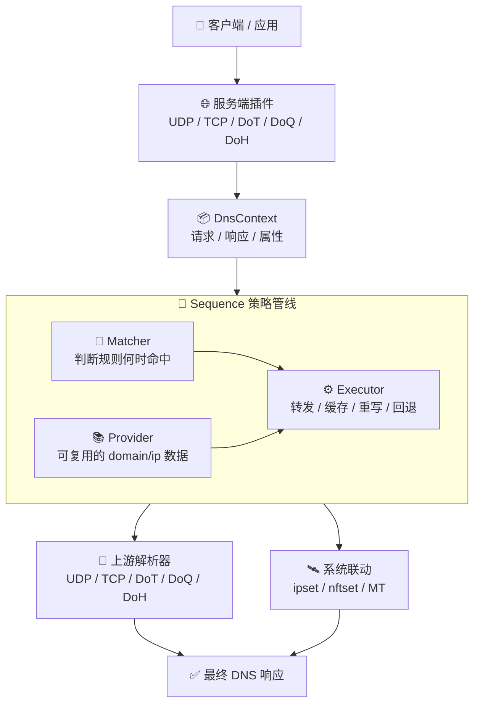

# ForgeDNS

[中文](README.md) | [English](README_EN.md)

**⚡ 一个面向现代网络、以性能优先为原则的可编排 DNS 服务器。**

ForgeDNS 是一个使用 Rust 编写的高性能 DNS 项目。
它不是为了做一个“功能很多”的 DNS 工具，而是希望做一个真正适合作为网络基础设施长期使用的 DNS 核心：快、稳、可控，而且能持续演进。

项目受 mosdns 启发，底层建立在 Tokio 与自研 wire-first DNS 消息层之上，整个设计围绕一句话展开：

**当 DNS 成为策略引擎时，它仍然应该足够快。**

项目目前仍处于持续开发阶段。

## ✦ 快速认识 ForgeDNS

> **更快的 DNS 路径，更清晰的策略编排，更现代的协议支持。**
>
> ForgeDNS 希望解决的，不只是“把请求转发出去”，而是让 DNS 在承担缓存、过滤、回退、重写、系统联动这些职责时，依然保持足够好的延迟、吞吐和可维护性。

| 维度 | ForgeDNS 的关注点 |
| --- | --- |
| ⚡ 性能 | 让 DNS 尽量远离系统瓶颈，而不是随着功能增加不断变慢 |
| 🧩 编排 | 用统一的策略管线组织 matcher、executor、provider |
| 🔐 协议 | 同时覆盖传统 DNS 与现代加密 DNS 协议栈 |
| 🛰️ 联动 | 让 DNS 不只负责解析，还能驱动系统控制与网络行为 |

## 为什么是 ForgeDNS

很多 DNS 软件一开始都很简单，但随着策略、协议、上游类型、系统联动和运维需求不断增加，结构会逐渐变得混乱，性能也开始被一点点吞掉。

ForgeDNS 想解决的正是这个问题。

它从一开始就不是按“能不能把功能堆上去”来设计，而是按下面这个目标来设计：

- ⚡ 让 DNS 保持低延迟
- 🧩 让复杂策略可以被优雅编排
- 🔐 让现代加密 DNS 协议成为一等能力
- 🌐 让 DNS 不只负责解析，还能成为网络控制的一部分
- 🧱 让系统在长期演进时，依然保持结构清晰

ForgeDNS 不是“另一个 forwarder”。
它更接近一个面向真实网络场景的高性能 DNS 内核。

## 为什么高性能 DNS 很重要

高性能 DNS 的价值，从来不只是基准测试数字更好看。

DNS 是几乎所有网络连接的起点。
如果 DNS 慢，浏览器更慢，应用更慢，服务调用更慢，整个网络都会显得迟钝。
如果 DNS 在高并发和复杂策略下变得不稳定，后面的所有系统都会为它买单。

对 DNS 服务器来说，性能真正意味着：

- 每次连接开始前更低的解析延迟
- 并发升高时更好的尾延迟表现
- 更少的 CPU 和内存浪费
- 在缓存、过滤、路由、观测逻辑叠加后仍然留有性能余量
- 不让 DNS 自己变成整个网络栈的瓶颈

真正值得选择的高性能 DNS，不是“在最简单的场景里很快”，而是“在真实复杂度下依然快”。
ForgeDNS 正是在围绕这一点构建。

## ForgeDNS 的核心优势

### ⚡ 性能不是补充项，而是架构前提

ForgeDNS 当前很多设计，天然就是为了减少热路径损耗：

- 使用 Rust，降低运行时开销并让内存行为更可控
- 使用 Tokio 多线程异步运行时，适合高并发 I/O 场景
- 为上游连接提供协议感知的连接池、连接复用和 pipeline 机制
- 使用 TTL 感知缓存与通用 TTL cache 原语，减少重复解析代价
- 通过 `provider` 展平规则集引用，避免递归式策略开销
- 通过 `post_execute` 把观测类、副作用类逻辑尽量与主响应路径分离

也就是说，ForgeDNS 的性能不是后面再“优化出来”的，而是一开始就在架构层面约束出来的。

### 🧠 它把策略能力当作一等公民

ForgeDNS 没有把复杂行为塞进监听器或者某个 transport 的特殊逻辑里。
它把系统拆成了边界清晰的几层：

- `server` 负责协议接入
- `sequence` 负责策略编排
- `matcher` 负责条件判断
- `executor` 负责执行动作
- `provider` 负责提供可复用的 domain/ip 数据

这带来的好处很直接：

- 功能更容易扩展
- 策略更容易表达和组合
- 核心数据路径更清晰
- 项目在变复杂之后，更不容易失去可维护性和性能边界

### 🌍 它面向的是现代 DNS，而不是过去的 DNS

ForgeDNS 当前已经在服务端和上游侧同时覆盖现代 DNS 协议栈：

- UDP
- TCP
- DoT
- DoQ
- DoH

同时还支持：

- bootstrap 解析
- SOCKS5 上游拨号
- 多上游并发竞争
- 面向不同协议的连接复用与 pipeline

这意味着 ForgeDNS 不是一个只适合单一场景的小工具，而是一个可以承担现代 DNS 基础设施角色的系统。

### 🛰️ 它关注的不只是解析，还关注网络控制

ForgeDNS 已经不再把自己局限在“接收请求，然后返回响应包”这件事上。
当前代码中已经具备的系统联动能力包括：

- Linux `ipset` 写入
- Linux `nftables set` 写入
- MikroTik RouterOS 路由同步
- 基于观测结果生成 reverse lookup 缓存

这让 ForgeDNS 更适合被用于：

- 网关控制
- 策略路由
- 分流体系
- 家庭网络策略
- DNS 驱动的系统联动场景

### 🧱 它不是一条死路，而是一个能继续长大的系统

ForgeDNS 还在早期，但路线已经很清晰：

- 监听器保持尽量精简
- 大部分行为沉到可组合的策略层
- 上游协议复杂度收敛在统一抽象之下
- 新能力优先通过模块和插件生长，而不是不断污染核心主流程

这让 ForgeDNS 更适合长期演进，而不是随着功能增长逐渐变成一个难以维护的混合体。

## 🚀 性能设计原则

ForgeDNS 的性能目标，并不是依赖某一个“黑科技优化点”，而是依赖一组一致的工程原则。

### 1. 热路径尽量短

请求进入系统后，监听器层尽量只做接入、解码、转交，不在 transport 层堆积策略逻辑。
策略判断主要放在统一的 `sequence` 管线里完成，这样可以减少协议分支带来的重复成本，也更容易控制主路径长度。

### 2. 避免把复杂度直接压到每个请求上

很多复杂能力都被设计成“初始化时准备、运行时复用”的模式，例如：

- provider 会展平规则集引用，避免运行时递归查找
- 域名/IP 规则会预编译或预组织成更适合匹配的数据结构
- `DnsContext` 会缓存 query view，避免重复规范化和拆分查询名

原则很明确：能在启动期或低频路径做的事，尽量不要留到每个请求里重复做。

### 3. 连接是资源，不是一次性耗材

对上游而言，握手、建连、协议初始化都是昂贵操作。
所以 ForgeDNS 在 upstream 侧使用了按协议感知的连接复用、连接池和 pipeline 机制，用来摊销这些成本。

这让系统在以下场景下更有优势：

- DoT / DoQ / DoH 这类握手成本更高的上游
- 并发较高、请求密集的转发场景
- 多上游竞争查询下的整体时延控制

### 4. 让副作用尽量离开主响应路径

日志、指标、系统联动、路由同步、集合写入这类能力很重要，但它们不应该无条件阻塞主解析路径。
ForgeDNS 通过 `post_execute`、后台维护任务、异步队列等方式，把一部分观测与副作用工作从最敏感的响应路径中拆开。

这背后的原则不是“不要副作用”，而是“副作用应当以可控方式存在”。

### 5. 缓存不仅要有，还要和 TTL 语义一致

ForgeDNS 不是简单地“把响应塞进 map”。
当前缓存设计强调 TTL、负缓存、过期淘汰和持久化边界，这样做的意义在于：

- 提升命中时的响应效率
- 避免缓存逻辑偏离 DNS 协议语义
- 让缓存成为减负机制，而不是一致性风险来源

### 6. 控制锁竞争和共享状态膨胀

高性能 DNS 的一个常见问题，是共享状态越来越多，最后热路径被锁和协调成本拖慢。
ForgeDNS 在多个地方都倾向于采用更轻的共享方式、原子计数、可局部维护的数据结构，以及后台定期维护任务，尽量避免把全局协调成本直接放在请求主路径上。

### 7. 性能和可扩展性一起设计

很多系统在早期很快，但一旦要加策略、加插件、加协议，就会开始明显退化。
ForgeDNS 的出发点不是做一个“只有在功能很少时才快”的 DNS，而是做一个随着功能增加，仍然能保持结构稳定、性能边界清晰的系统。

这也是为什么它会坚持：

- 分层清晰
- 插件边界清晰
- 上游抽象统一
- 策略编排统一

因为只有这样，性能优化才不会在项目演进过程中不断失效。

## 架构全景



在 ForgeDNS 中，一个请求通常按下面的路径流转：

1. `server` 插件接收 UDP、TCP、DoT、DoQ 或 DoH 请求
2. 请求进入统一的 `DnsContext`
3. `sequence` 按规则顺序执行 matcher 和 executor
4. `provider` 为策略层提供可复用的 domain/ip 数据
5. 响应返回客户端，同时 post-stage 仍可继续执行观测或副作用逻辑

它的意义在于：

- 控制能力和性能能力可以放在同一条管线里
- 功能可以被组合，而不是被硬编码
- 新能力更容易在不破坏主路径的情况下接入系统

## ✨ 当前已经具备的能力

ForgeDNS 目前已经包含：

- 🌐 服务端 UDP、TCP、DoT、DoQ、DoH
- 🔁 上游 UDP、TCP、DoT、DoQ、DoH
- ⚔️ 多上游转发与并发竞争
- 🧠 带 TTL 与负缓存能力的内存缓存
- 🛟 主备回退执行链
- 🧩 本地静态应答与任意 RR 合成应答
- 🔀 查询重写与响应改写
- 📍 ECS 处理
- ↔️ 双栈偏好控制
- 📚 可复用的 domain/ip 规则集 provider
- 🛰️ `ipset`、`nftset`、MikroTik 路由同步等 DNS 到系统的联动能力

## 🧭 典型使用场景

### 家庭网络与家长控制

当家庭网络需要统一控制访问行为时，DNS 往往是最自然的入口。
ForgeDNS 适合承担这个角色，因为它既能做基础解析，也能承载后续的规则、过滤和设备侧策略。

适合的方向包括：

- 面向家庭成员的访问控制
- 面向终端设备的差异化策略
- 面向儿童设备的家长控制能力
- 后续接入广告过滤与规则集能力

### 网关、旁路由与策略路由

对于网关和旁路由场景，DNS 不只是解析器，更是策略入口。
ForgeDNS 当前已经具备把解析结果继续送到系统层的能力，适合做 DNS 驱动的流量控制。

适合的方向包括：

- 基于域名结果做策略路由
- 通过 `ipset` / `nftset` 驱动内核侧分流
- 通过 MikroTik 路由同步驱动 RouterOS 侧控制
- 让 DNS 结果直接参与网络出口选择

### 多上游与复杂解析策略

当网络环境需要多个上游、不同协议、主备回退和延迟竞争时，简单 forwarder 往往很快就不够用了。
ForgeDNS 更适合这种“解析策略本身就很复杂”的场景。

适合的方向包括：

- 多上游并发竞争
- 主备上游切换与故障回退
- 传统 DNS 与加密 DNS 混合使用
- 针对不同请求条件走不同策略链

### 规则驱动的过滤与重写

如果你的 DNS 不只是要“回答问题”，而是还要根据规则改变结果、拦截结果或生成本地结果，那么 ForgeDNS 的策略编排模型会更有优势。

适合的方向包括：

- 静态应答和任意记录合成
- 查询重写与响应改写
- 基于域名、客户端、响应内容的规则判断
- 后续接入 AdGuard 规则、URL 规则集、V2Ray `.dat` 规则文件

### 可持续演进的自建 DNS 基础设施

有些用户要的不是“现在能跑起来”，而是“未来不用推倒重来”。
ForgeDNS 适合那些希望把 DNS 作为长期基础设施来建设的场景。

这类场景通常关心：

- 项目是否有清晰的技术方向
- 能力是否可以继续扩展
- 新功能是否可以在不破坏核心路径的前提下接入
- 性能是否能随着功能增长继续维持边界

## 代表性能力组件

README 这里不打算展开完整配置手册，插件详细配置会放到后续 WikiBook。

当前最能代表 ForgeDNS 设计思路的组件包括：

- `sequence`：策略编排核心
- `forward`：统一上游转发执行器
- `cache`：热路径响应缓存
- `fallback`：主备回退编排
- `hosts`、`arbitrary`、`redirect`、`black_hole`：本地应答与重写基础能力
- `domain_set`、`ip_set`：可复用规则集 provider
- `qname`、`client_ip`、`resp_ip`、`rcode`、`rate_limiter`：典型策略 matcher
- `ipset`、`nftset`、`mikrotik`、`reverse_lookup`：DNS 与系统联动插件
- `metrics_collector`、`query_summary`、`debug_print`：轻量观测与调试能力

## 🎯 什么样的用户会选择 ForgeDNS

如果你需要的是下面这样的 DNS 系统，ForgeDNS 会是一个很合适的选择：

- ⚡ 一个从一开始就重视性能边界的自建 DNS 核心
- 🔐 一个同时覆盖传统 DNS、加密 DNS 和策略 DNS 的统一系统
- 🌐 一个不只做解析、还能参与路由、过滤和网络控制的 DNS 平台
- 🧩 一个可以通过组合持续扩展，而不是靠堆开关维持功能的架构
- 🧭 一个技术路线清晰、适合长期演进的项目

## 构建与运行

```bash
cargo build --release
cargo run -- -c config.yaml
cargo run -- -l debug
```

当前的 `config.yaml` 是理解 ForgeDNS 现阶段装配方式和插件模型的最佳起点。

## 🛣️ 后续计划

接下来计划推进的内容包括：

- 管理用 HTTP 接口
- Prometheus 接入与指标导出
- 家庭控制 / 家长控制能力
- 广告过滤，支持 AdGuard 规则
- 支持通过 URL 读取 domain 和 IP 规则集
- 支持读取 V2Ray 的 `.dat` 规则文件

说明：项目现在已经有 `http_server`，但它是面向 DoH 的服务插件。这里计划中的 HTTP 接口，指的是独立的管理接口，而不是 DoH 本身。

## 鸣谢

ForgeDNS 的设计与实现，明显受到了以下项目的重要启发：

- [mosdns](https://github.com/IrineSistiana/mosdns)
  - 原始的 Go 语言项目，为 ForgeDNS 提供了非常关键的插件化 DNS 策略思路参考。
- [hickory-dns](https://github.com/hickory-dns/hickory-dns)
  - 为 ForgeDNS 提供 DNS 协议处理基础能力的重要 Rust 项目。

## 许可证

GPL-3.0-or-later
