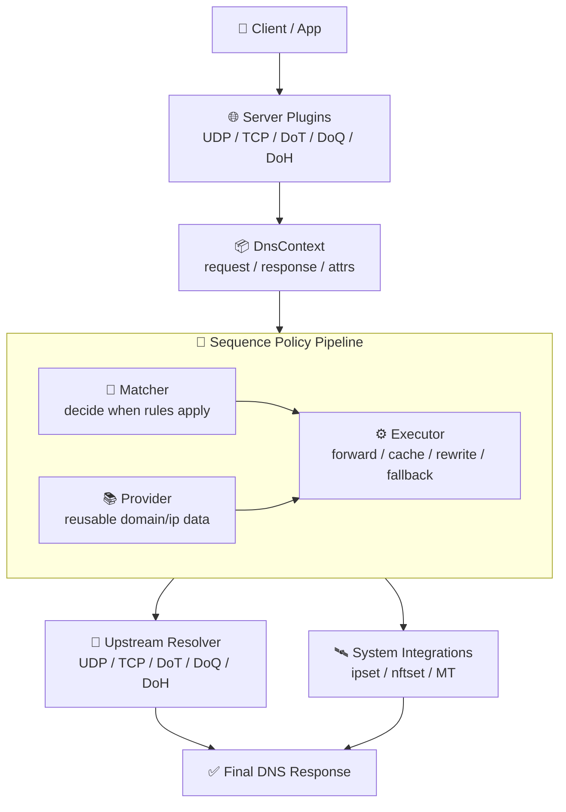

# ForgeDNS

[中文](README.md) | [English](README_EN.md)

**⚡ Performance-first programmable DNS for modern networks.**

ForgeDNS is a high-performance DNS server written in Rust.
It is being built for users who want DNS to be fast, controllable, and architecturally clean, not just feature-rich.

Inspired by mosdns and built on Tokio plus a self-built wire-first DNS message layer, ForgeDNS is designed around one idea:

**DNS should remain fast even when it becomes your policy engine.**

The project is under active development.

## ✦ ForgeDNS At A Glance

> **A faster DNS path, a cleaner policy model, and a more modern transport stack.**
>
> ForgeDNS is not only about forwarding queries. It is about keeping DNS efficient even when it also needs to handle cache, filtering, fallback, rewriting, and system-facing side effects.

| Dimension | What ForgeDNS Optimizes For |
| --- | --- |
| ⚡ Performance | Keep DNS away from becoming the bottleneck as features grow |
| 🧩 Orchestration | Express resolver behavior through one policy pipeline |
| 🔐 Protocols | Cover both classic DNS and modern encrypted DNS transports |
| 🛰️ Integration | Let DNS participate in system and network control, not only resolution |

## Why ForgeDNS

Most DNS software starts simple, then gets slower and harder to reason about as policy, transports, integrations, and operational requirements accumulate.

ForgeDNS takes the opposite direction.
It is designed from the beginning to support:

- ⚡ low latency on the critical path
- 🧩 composable policy orchestration
- 🔐 modern encrypted DNS transports
- 🌐 system-level integration beyond packet forwarding
- 🧱 long-term extensibility without architectural drift

This is not just a resolver.
It is a performance-oriented DNS core for real networks.

## Why High-Performance DNS Matters

DNS is the first step of almost every connection.
If DNS is slow, the whole network feels slow.
If DNS becomes unstable under policy load, the rest of the stack pays for it.

For a serious DNS server, performance means:

- lower latency before every outbound connection
- better tail behavior under concurrency
- lower CPU and memory overhead on the hottest path in the network
- more room for cache, filtering, routing, and observability without turning DNS into the bottleneck

A DNS server that is only fast in trivial cases is not enough.
Modern deployments need performance under real policy complexity.

## What Makes ForgeDNS Different

### ⚡ Performance is part of the architecture

ForgeDNS is structured to reduce avoidable overhead:

- Rust for low runtime overhead and predictable memory behavior
- Tokio for concurrent, I/O-heavy workloads
- protocol-aware upstream connection pooling, reuse, and pipelining
- TTL-aware cache primitives for hot-path efficiency
- flattened provider lookups to avoid recursive policy overhead
- post-stage side effects to keep the main response path cleaner

Performance here is not a late optimization pass.
It is a design constraint.

### 🧠 Policy is a first-class capability

ForgeDNS does not bury behavior inside transport-specific code paths.
It separates concerns clearly:

- `server` plugins accept traffic
- `sequence` orchestrates policy
- `matcher` plugins decide when rules apply
- `executor` plugins perform actions
- `provider` plugins supply reusable domain and IP data

That separation makes the system easier to extend, reason about, and keep fast as features grow.

### 🌍 It is built for today's DNS reality

ForgeDNS already supports a modern transport stack on both ingress and egress:

- UDP
- TCP
- DoT
- DoQ
- DoH

It also supports bootstrap resolution, SOCKS5 dialing, multi-upstream concurrency, and transport-appropriate connection reuse.

A modern DNS system should not force users to choose between flexibility and protocol coverage.

### 🛰️ It treats DNS as infrastructure, not just resolution

ForgeDNS is already moving beyond pure packet forwarding.
Current system-facing capabilities include:

- Linux `ipset` integration
- Linux `nftables` set integration
- MikroTik RouterOS route synchronization
- reverse lookup cache generation from observed answers

This makes ForgeDNS relevant not only for resolution, but also for routing, segmentation, gateway control, and policy-driven networking.

### 🧱 It is designed to keep growing cleanly

ForgeDNS is still early, but the direction is already visible:

- keep listeners thin
- keep most behavior in composable policy layers
- hide upstream protocol complexity behind unified abstractions
- add capability through clean modules instead of core-loop sprawl

That gives ForgeDNS a stronger long-term shape than software that grows by accumulating special cases.

## 🚀 Performance Design Principles

ForgeDNS does not depend on a single magic optimization.
Its performance model comes from a set of consistent engineering rules.

### 1. Keep the hot path short

Once a request enters the system, listener layers should do as little as possible beyond accept, decode, and dispatch.
Policy logic is kept in the unified `sequence` pipeline instead of being duplicated across transport-specific paths.
That reduces repeated branching and keeps the critical path easier to control.

### 2. Do expensive work once, reuse it many times

Complexity should be prepared ahead of the request path whenever possible. Examples already present in the codebase include:

- providers flatten referenced rule sets before runtime matching
- domain and IP rules are organized into match-friendly structures
- `DnsContext` caches a normalized query view so qname processing is not repeated unnecessarily

The principle is simple: work that can be moved to initialization or low-frequency paths should not be paid for on every query.

### 3. Treat connections as reusable assets

For upstreams, handshake and connection setup are expensive.
ForgeDNS uses protocol-aware pooling, reuse, and pipelining to amortize that cost.
This is especially important for:

- DoT / DoQ / DoH upstreams
- high-concurrency forwarding workloads
- multi-upstream racing where aggregate latency matters

### 4. Keep side effects away from the most sensitive path

Logging, metrics, route sync, set writes, and other side effects matter, but they should not blindly block the response path.
ForgeDNS uses mechanisms such as `post_execute`, maintenance tasks, and async queues to decouple parts of that work from the hottest portion of request handling.

The goal is not to eliminate side effects.
The goal is to keep them controlled.

### 5. Make cache behavior consistent with DNS semantics

A useful DNS cache is not just a hash map with responses in it.
ForgeDNS emphasizes TTL-aware caching, negative caching, expiration handling, and persistence boundaries so cache behavior remains aligned with resolver expectations instead of becoming a hidden correctness risk.

### 6. Limit lock pressure and shared-state inflation

One common way DNS systems lose performance is by allowing global shared state to grow until locking and coordination dominate the hot path.
ForgeDNS consistently leans toward lighter shared-state patterns, atomics where appropriate, locally maintainable structures, and background maintenance rather than pushing all coordination into request handling.

### 7. Design for performance and extensibility together

Some systems are fast only while they remain simple.
Once policy, plugins, and transports accumulate, the architecture starts fighting itself.
ForgeDNS is being built to avoid that trap.

That is why it keeps insisting on:

- clear layering
- explicit plugin boundaries
- unified upstream abstractions
- a single policy orchestration model

Without those constraints, performance work tends to decay as the project grows.

## Architecture At A Glance



A request typically flows like this:

1. a `server` plugin accepts UDP, TCP, DoT, DoQ, or DoH traffic
2. the request enters `DnsContext`
3. `sequence` evaluates matchers and dispatches executors
4. providers supply reusable domain/IP data to the policy layer
5. the response is returned, while optional post-stage logic can still observe or trigger side effects

The result is a DNS pipeline that combines control and performance instead of trading one for the other.

## ✨ Current Capabilities

ForgeDNS already includes:

- 🌐 server-side UDP, TCP, DoT, DoQ, and DoH
- 🔁 upstream UDP, TCP, DoT, DoQ, and DoH
- ⚔️ multi-upstream forwarding and concurrent racing
- 🧠 in-memory DNS cache with TTL and negative-cache handling
- 🛟 fallback execution between primary and standby paths
- 🧩 local static answers and arbitrary resource-record responses
- 🔀 query rewriting and response rewriting
- 📍 EDNS Client Subnet handling
- ↔️ dual-stack preference helpers
- 📚 reusable domain/IP rule-set providers
- 🛰️ DNS-to-system integrations such as `ipset`, `nftset`, and MikroTik route sync

## 🧭 Use Cases

### Home network and parental control

When a home network needs centralized access control, DNS is often the most natural control point.
ForgeDNS fits this role well because it can handle baseline resolution while also serving as the place where filtering and device-specific policy evolve over time.

Good fits include:

- access control for different family members
- device-specific policy handling
- parental control workflows for child devices
- future integration with ad blocking and external rule sources

### Gateways, side routers, and policy routing

In gateway and side-router deployments, DNS is not only resolution. It is also a policy entry point.
ForgeDNS already has the foundations needed to push DNS results into surrounding system behavior, which makes it a good fit for DNS-driven traffic steering.

Good fits include:

- policy routing based on resolved domains
- kernel-side traffic steering with `ipset` / `nftset`
- RouterOS-side control through MikroTik route synchronization
- using DNS outcomes to influence egress path selection

### Multi-upstream and advanced resolution strategy

When an environment needs multiple upstreams, mixed transports, failover, and latency racing, a simple forwarder tends to run out of headroom quickly.
ForgeDNS is better aligned with cases where the resolution strategy itself is complex.

Good fits include:

- multi-upstream racing
- primary/standby upstream failover
- mixed classic DNS and encrypted DNS upstream usage
- different resolution pipelines for different request conditions

### Rule-driven filtering and rewriting

If your DNS layer is expected not only to answer queries but also to rewrite, intercept, or synthesize results based on policy, ForgeDNS's orchestration model becomes much more valuable.

Good fits include:

- static local answers and arbitrary record synthesis
- query rewriting and response rewriting
- rule decisions based on domain, client, or response content
- future integration with AdGuard rules, URL-delivered rule sets, and V2Ray `.dat` data files

### Long-lived self-hosted DNS infrastructure

Some users do not just want something that works today. They want something they can keep building on.
ForgeDNS fits scenarios where DNS is treated as long-term infrastructure rather than a disposable utility.

Those scenarios usually care about:

- whether the technical direction is clear
- whether capabilities can keep growing cleanly
- whether new features can be added without damaging the critical path
- whether performance boundaries can still hold as functionality expands

## Representative Building Blocks

README intentionally does not try to be the full plugin manual. Detailed configuration will move to the WikiBook.

The most representative components today are:

- `sequence`: policy orchestration core
- `forward`: unified upstream forwarding executor
- `cache`: hot-path response cache
- `fallback`: primary/standby failover composition
- `hosts`, `arbitrary`, `redirect`, `black_hole`: local answer and rewrite primitives
- `domain_set`, `ip_set`: reusable rule-set providers
- `qname`, `client_ip`, `resp_ip`, `rcode`, `rate_limiter`: common policy matchers
- `ipset`, `nftset`, `mikrotik`, `reverse_lookup`: DNS-to-system integration plugins
- `metrics_collector`, `query_summary`, `debug_print`: lightweight observability helpers

## 🎯 Who ForgeDNS Is For

ForgeDNS is a strong fit if you want:

- ⚡ a self-hosted DNS core that is performance-conscious from the start
- 🔐 a resolver that can cover classic DNS, encrypted DNS, and policy DNS in one system
- 🌐 DNS-driven routing, filtering, or gateway behavior
- 🧩 an architecture that can grow through composition instead of becoming a monolith
- 🧭 a project with a clear long-term technical direction

## Build And Run

```bash
cargo build --release
cargo run -- -c config.yaml
cargo run -- -l debug
```

The sample `config.yaml` is the best starting point for understanding how ForgeDNS is assembled today.

## 🛣️ Roadmap

The next major items on the roadmap are:

- management HTTP API
- Prometheus integration and exporter support
- family / parental control features
- ad blocking with AdGuard rule support
- loading domain and IP rule sets from URLs
- reading V2Ray `.dat` rule files

Note: ForgeDNS already includes `http_server` for DoH. The roadmap item above refers to a separate management HTTP interface.

## Acknowledgements

ForgeDNS is deeply influenced by:

- [mosdns](https://github.com/IrineSistiana/mosdns), the original Go project that inspired much of the policy and plugin direction
- [hickory-dns](https://github.com/hickory-dns/hickory-dns), which provides the protocol foundation used by this project

## License

GPL-3.0-or-later
