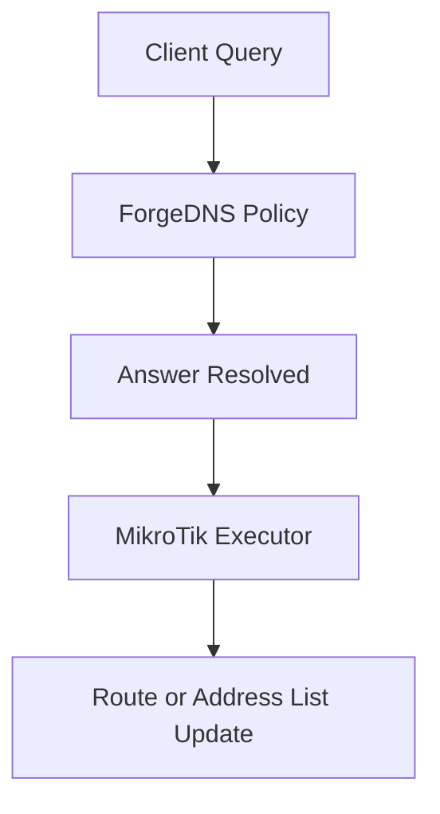

This page explains how ForgeDNS can coordinate with MikroTik route rules.

## Purpose

The `ros_address_list` executor uses DNS results to drive route policy updates on MikroTik devices. This is useful when domain resolution is part of the decision for policy routing or traffic steering.

## Typical Flow



## Common Deployment Pattern

1. Match a domain group with `domain_set`.
2. Resolve with `forward`.
3. Pass the response through the `ros_address_list` executor.
4. Push address information into the MikroTik side.

## Notes

- Keep the DNS response path reliable even if MikroTik updates fail.
- Prefer bounded retries and observability around synchronization.
- Verify TTL behavior so route state does not drift too far from DNS truth.

## Minimal Example

```yaml
- tag: seq_main
  type: sequence
  args:
    - matches: "$streaming_domains"
      exec: "$forward_main"
    - matches: "$has_resp"
      exec: "$ros_address_list_main"
```

## Operational Advice

- Isolate MikroTik credentials and management endpoints.
- Measure sync latency separately from DNS latency.
- Keep route sync side effects observable and debuggable.
